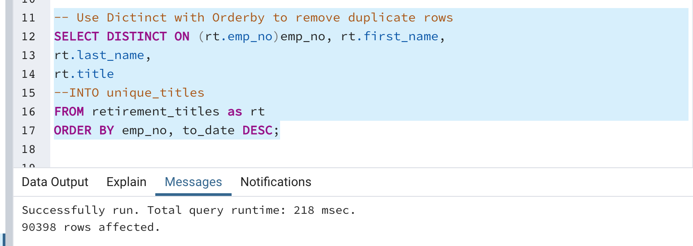
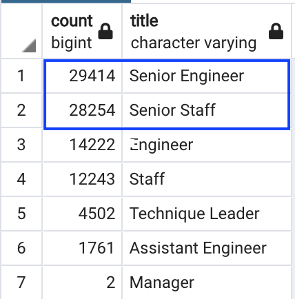
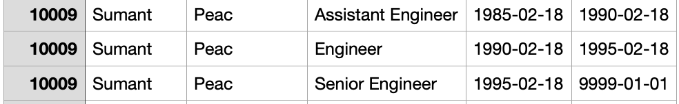
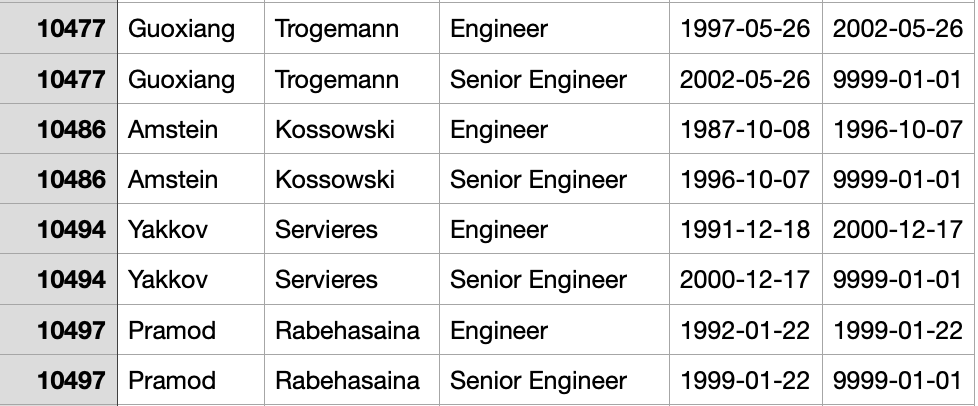
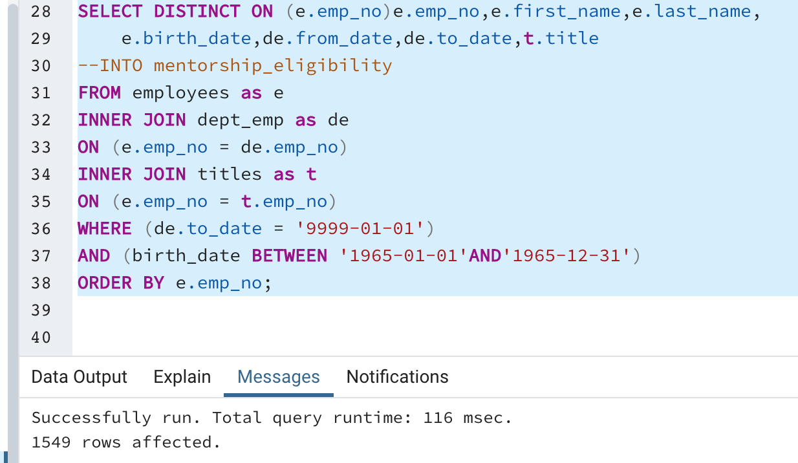
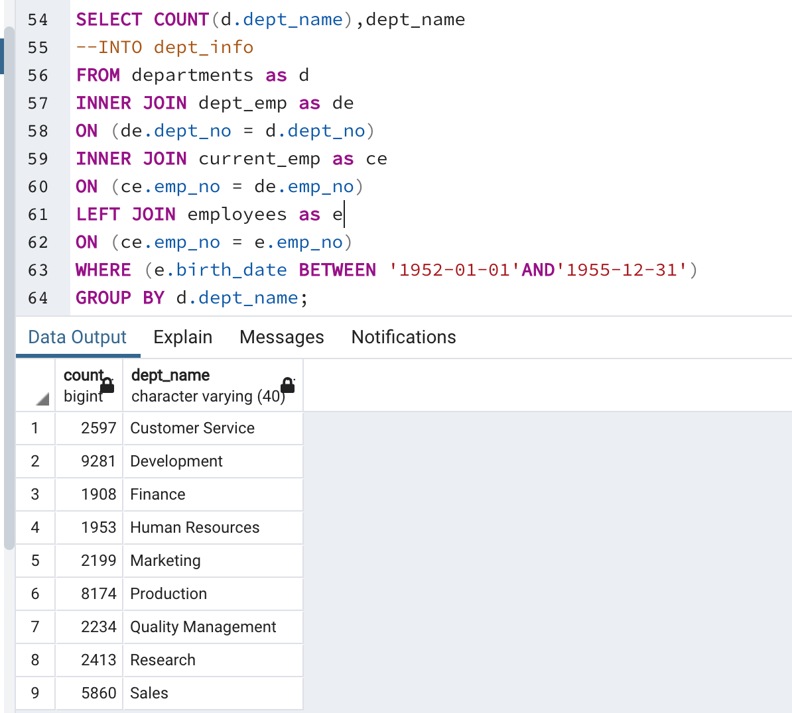

# Pewlett-Hackard-Analysis

## Project Overview
The purpose of this project is to help Pewlett_Hackard prepare for the upcoming retirement of some of their workforce and identify employees who woukd be eligile for their mentorship program.

## Results

* Pewlett_Hackard has a total of 90,398 employess who will be retiring soon 

* Of the above number 57,668 hold Senior positions 

* Pewlett_Hackard has multiple employees who through promotions have changed roles 1 - 2 times. 

* There are 1,549 employees who fit the criteria for mentorship eligibility

## Summary 

Based on the information that is available Pewlett-Hackard is expected to have 21,209 employees retire in 2022. This is based on a query that was run on the Retirement_Titles table as seen in the screenshot below:

![Screenshot] (Data/Screenshots/Summary_1.png)

Pewlett-Hackard has 9 departments and each of these departments have ample retirement ready employees to mentor the next generation of employees as seen in the following screenshot:

